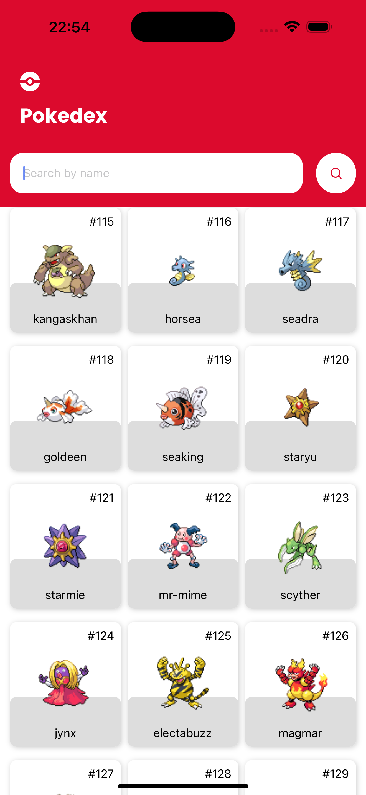
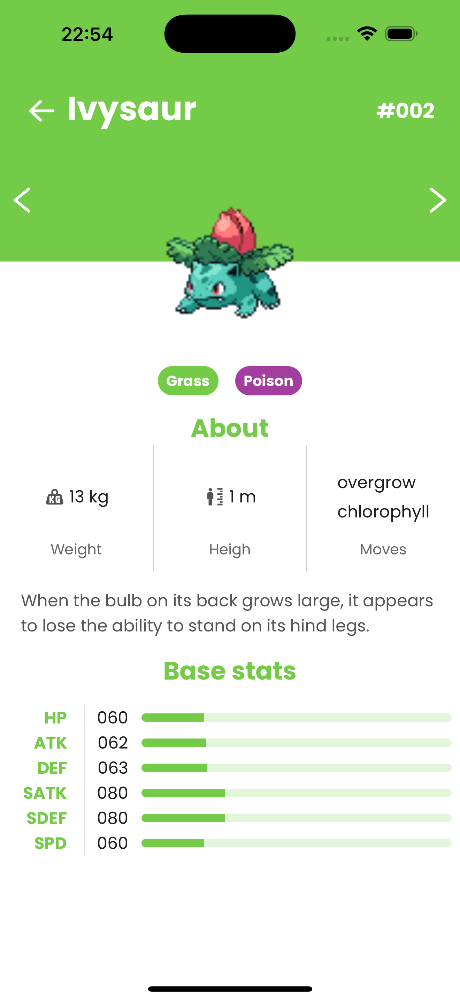

# 📱 Pokédex Mobile App

A modern Pokédex mobile application built with **React Native**, powered by **Expo**, and using **npm** as the package manager.
This app allows users to explore Pokémon information, search by name or ID, and view detailed stats, types, and abilities.

---

## 🚀 Features
- Search Pokémon by name
- View Pokémon images, types, and stats
- Simple and intuitive UI
- Works on both **Android** and **iOS**
- Built with **Expo** for easy development and testing

---

## 📋 Prerequisites
Make sure you have the following installed on your machine:
- **Node.js** (v16 or higher)
- **npm** (v7 or higher)

---

## 🛠 Installation

### 1️⃣ Clone the repository
```
git clone https://github.com/FabioChebabe/pokedex-mobile.git
cd pokedex-mobile
```

### 2️⃣ Install dependencies
```
npm install (or npm i)
```

### 3️⃣ Start the development server
```
npm run start
```

## 📱 Running on your device
Install the Expo Go app from the App Store (iOS) or Google Play Store (Android).

Scan the QR code shown in your terminal or browser after running npm run start.

The app will open instantly on your device.

## 🧩 Technologies Used
- React Native
- Expo
- TypeScript
- React Navigation
- PokéAPI for Pokémon data




## 📄 License
This project is licensed under the MIT License.

## ✨ Author
Developed by Fabio Carnelli